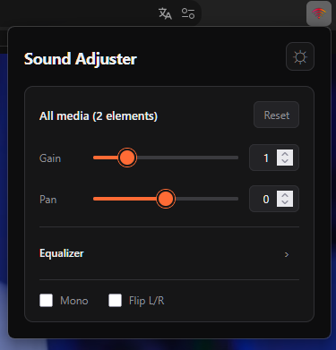
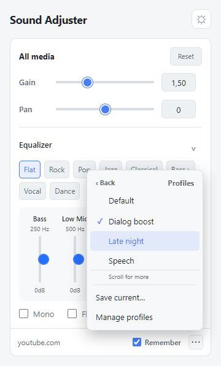

# Sound Adjuster

Sound Adjuster is a Firefox extension for changing the volume, stereo balance, and equalizer settings of audio and video on the current page.

## Screenshots

| Dark theme | Light theme |
| --- | --- |
|  |  |

## Features

- Volume gain from 0× to 5×
- Left and right stereo balance
- Five-band equalizer with presets
- Mono and channel-flip controls
- Light and dark themes
- Automatic detection of media added after the page loads

## Install from source

1. Download or clone this repository.
2. Open `about:debugging#/runtime/this-firefox` in Firefox.
3. Select **Load Temporary Add-on**.
4. Choose `manifest.json` from the project folder.

Temporary add-ons are removed when Firefox closes.

## Compatibility

The extension works with standard HTML audio and video elements. Some sites use cross-origin media or DRM that Firefox does not allow extensions to process safely. In those cases, Sound Adjuster leaves the original playback unchanged and displays an availability message.

## Support

Sound Adjuster is free and open source. If you find it useful, you can [support its continued development](https://buymeacoffee.com/tropicaddons).

## License

[MIT](LICENSE)
